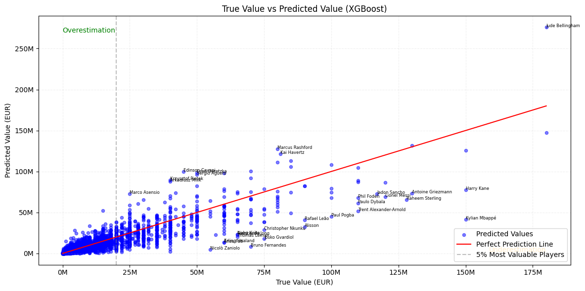

# Football Players Market Value Prediction

This project is a machine learning task aimed at predicting the market value of football players based on their attributes and performance data. We utilized a comprehensive dataset of football players to train, test, and validate our models.

---

## Project Overview

Football clubs invest heavily in players, and accurately estimating a player's market value can provide significant advantages in terms of transfers, negotiations, and financial planning. By leveraging machine learning, we aim to provide a data-driven approach to market value prediction.

### Key Features:
- **Dataset**: Contains detailed information on football players, including attributes like age, position, club, nationality, stats (e.g., goals, assists), and more.
- **Goal**: Predict the market value of players using machine learning models.
- **Results**: Visualizations and performance metrics of the trained model.

---

## Dataset

The dataset used for this project includes the following key features:
- Player attributes: Age, Height, etc.
- Performance metrics: Goals scored, Assists, Matches played, etc.
- Additional details: Club, Nationality, League, Position, etc.

### Source:
The dataset was sourced from [[kaggle](https://www.kaggle.com/datasets/davidcariboo/player-scores)] and preprocessed to clean and normalize the data for training.

---

## Approach

1. **Data Preprocessing**:
   - Handling missing values.
   - Encoding categorical features.
   - Feature scaling.

2. **Exploratory Data Analysis (EDA)**:
   - Visualized key trends and correlations in the dataset.

3. **Modeling**:
   - Trained multiple machine learning models, including Linear Regression, Random Forest, and Gradient Boosting.

4. **Evaluation**:
   - Evaluated models using metrics like Mean Absolute Error (MAE), Root Mean Squared Error (RMSE), and R².

---

## Results

